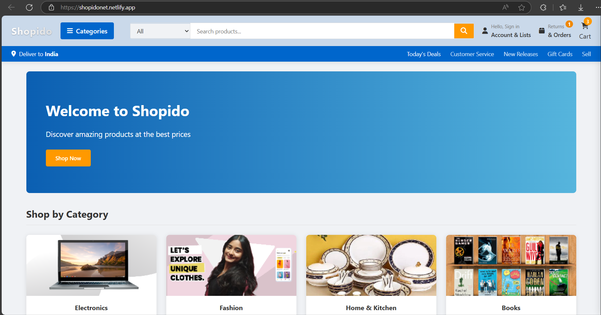
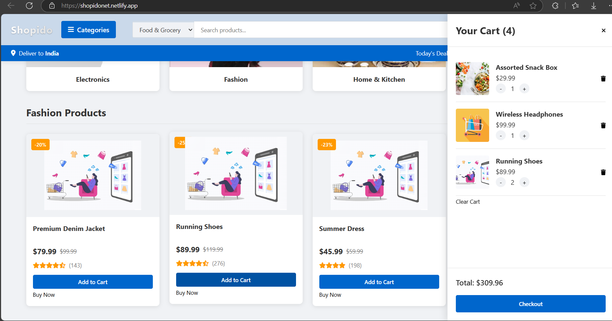
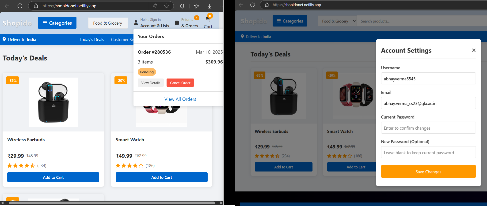
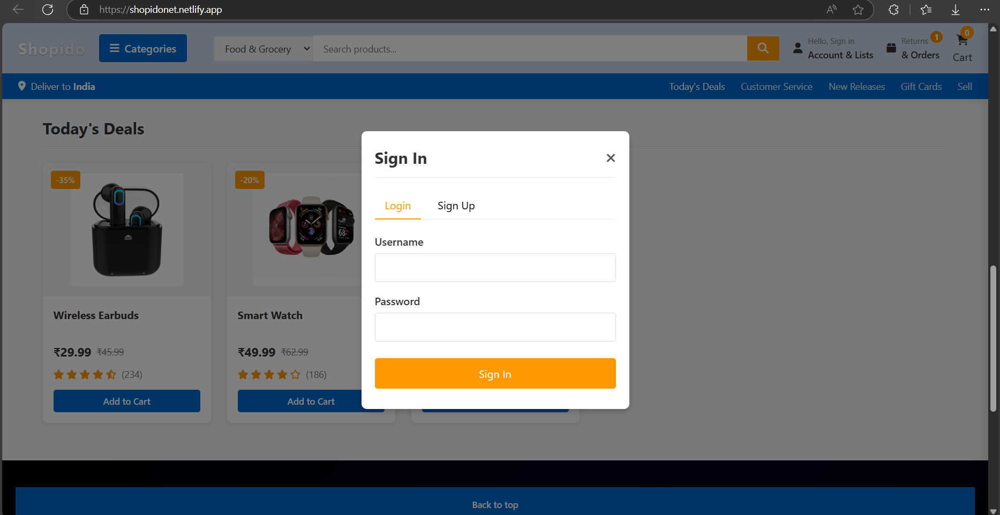

# 🛒 Shopido - Advanced AI Based Shopping Buddy

## ✨ What is Shopido?
Shopido is a stylish and easy-to-use online shopping website. 
It helps users browse products, add them to their cart, and check out smoothly.
The site is responsive, meaning it looks great on any device!

---


## 🚀 Key Features
### ✅ Easy Shopping Experience
- Simple and clean design
- Works on mobiles, tablets, and desktops
- Quick and smooth navigation

### ✅ Browse & Buy
- Products grouped into categories
- Search bar to find products easily
- Special deals and discounts

### ✅ Shopping Cart
- Add or remove items
- See real-time updates on your total amount
- Easy checkout process

### ✅ AI & ML Future Enhancements (Coming Soon!)
- **AI-based Image Recognition**: Find products by uploading images.
- **ML Shopping Assistance**: Smart recommendations based on user behavior.
- **Voice Search**: Shop using voice commands.

### ✅ More Features Coming Soon!
- User accounts and login
- Order tracking
- Personalized product recommendations

---

## 🛠️ Built With
### Frontend
- **HTML, CSS, JavaScript** for the website structure, styling, and functions
- **FontAwesome** for icons
- **Google Fonts** for stylish text
- **CSS Flexbox & Grid** for a responsive layout

### Future Backend (Planned)
- **Node.js & Express.js** for handling website functions
- **MongoDB or Firebase** for storing product and user data
- **User Authentication** for secure logins

### Hosting
- **GitHub Pages, Vercel, or Netlify** for the frontend
- **Heroku or AWS** for backend (if added later)

---

## 🔗 Live Demo & Preview
Check out the live demo: [Shopido Live](https://shopidonet.netlify.app/)
<br>
<br>
---


## 📁 Project Files
```
Shopido/
│── index.html    # Main webpage
│── style.css     # Styling for the website
│── script.js     # Functionality and interactions
│── assets/       # Images and icons
│── temp/         # Placeholder product images
│── README.md     # This guide
```

---

## 🏃 How to Open the Project
1. **Download the project**:
   ```sh
   git clone https://github.com/Abhay-Verma-2005/Shopido
   ```
2. **Go into the project folder**:
   ```sh
   cd shopido
   ```
3. **Open `index.html` in your browser**:
   ```sh
   start index.html   # Windows
   open index.html    # macOS
   ```

---

## 🚀 What’s Next?
- Add a backend for order processing
- Create a user login system
- Build an admin dashboard for managing products
- Use AI for smart product suggestions
- Implement **AI-based Image Recognition** and **ML-driven Personalized Shopping**

---


<br>
<br>
<br>
<br>
 

<br>
<br>
<br>
<br>
<br>
<br>

<br>
<br>
<br>
<br>


<br>
<br>
<br>
<br>



---

## 🤝 Want to Help?

Put the star ⭐ if you like the project.

---

## 📬 Need Help?
Have questions? Reach out here:
- 📧 Email: abhayverma5545@gmail.com
- 🌐 GitHub: [AbhayGitHub](https://github.com/Abhay-Verma-2005/Shopido)
- 🔗 Portofolio: [AbhayVerma](https://abhay5545portfolio.netlify.app/)

Happy Coding! 🚀

